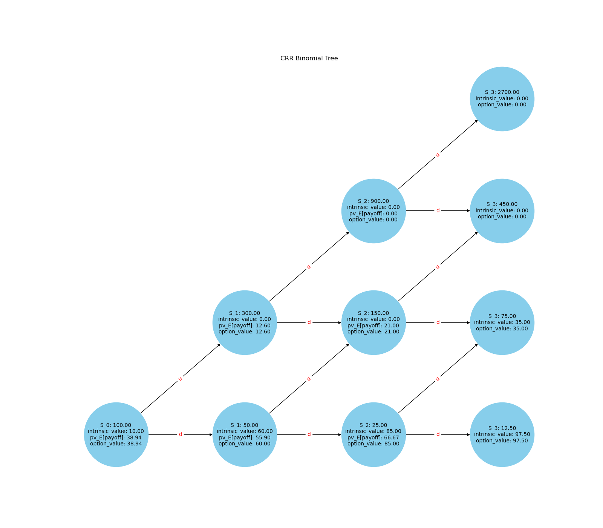

# American Options Pricing using Binomial Tree

## Description
This project implements the binomial tree method for pricing American put options.

This Jupyter Notebook provides an implementation of the binomial tree method for pricing American options. The binomial tree method is a popular numerical technique used in finance to estimate the value of options, taking into account the possibility of early exercise.

## An example of an American Put Option

### Definitions for Variables:
- **\( S_0 \)**: Initial stock price
- **\( u \)**: Upward movement factor
- **\( d \)**: Downward movement factor
- **\( R \)**: Risk-free Rate Parameter (1 + risk-free interest rate)
- **\( K \)**: Strike price of the put option
- **\( T \)**: Number of periods (time steps)

### Explanation for the Graph:
- **Intrinsic Value**: \( 	ext{max}(K - S_t, 0) \)
  - This represents the payoff from exercising the option at time \( t \).
- **pv_E[payoff]**: The present value of the expected payoff of holding the option, discounted using the risk-free rate.
  - This is calculated as:
    \[
    	ext{pv_E[payoff]} = rac{1}{R} \left( q \cdot 	ext{OptionValue}_{	ext{up}} + (1 - q) \cdot 	ext{OptionValue}_{	ext{down}} 
ight)
    \]
    where \( q \) is the risk-neutral probability given by:
    \[
    q = rac{R - d}{u - d}
    \]
- **Option Value**: \( 	ext{max}(	ext{intrinsic value}, 	ext{pv_E[payoff]}) \)
  - For an American option, this value is the maximum of the intrinsic value and the present value of the expected payoff because the option can be exercised at any time.

### Process:
1. **Calculate the intrinsic value at each node**: \( 	ext{Intrinsic Value} = 	ext{max}(K - S_t, 0) \).
2. **Calculate the present value of the expected payoff**: This involves computing the expected payoff of the option if it's held and not exercised immediately, and then discounting this value back at the risk-free rate.
3. **Determine the option value at each node**: For an American option, at each node, the option value is the maximum of the intrinsic value and the discounted expected payoff.

## Contents of the Jupyter Notebook
The notebook includes the implementations of the followings:
1. **Introduction**: Overview of American options and the binomial tree method.
2. **Parameters and Setup**: Setting up the initial parameters such as stock price, strike price, risk-free rate, volatility, and time to maturity.
3. **Binomial Tree Construction**: Constructing the binomial tree for the underlying asset prices.
4. **Option Valuation**: Calculating the option prices by working backwards through the binomial tree.
5. **Results and Visualization**: Presenting the calculated option prices and visualizing the binomial tree.