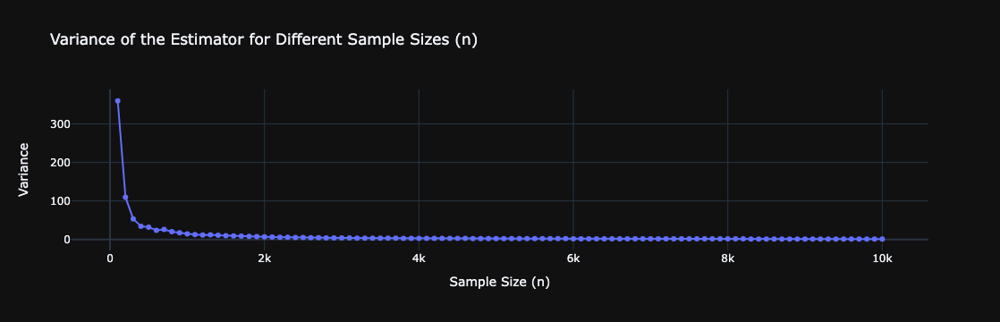
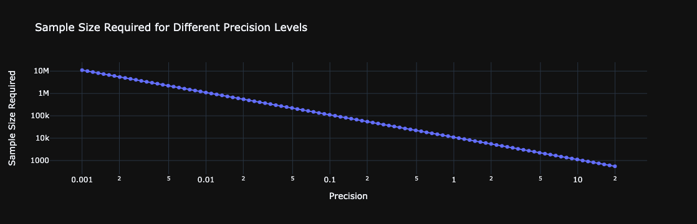

# Monte Carlo Simulation and Variance Estimation

This project demonstrates the use of Monte Carlo simulation to estimate the expected value of a given expression. The project also includes variance estimation and visualization.

Variance estimation is crucial in real-world applications due to constraints on time and computational power. By estimating the variance of our estimator, we can evaluate how advanced techniques, such as antithetic variables and importance sampling, enhance the efficiency of our Monte Carlo simulations by reducing variance. Further details on these techniques will be shared in another document.

In this project, we use `max(N^3 - K, 0)` as the example, where N is a normally distributed random variable.

For the following graph, the plane is colored according to the expectation values, with the corresponding colors shown in the color bar on the right-hand side.

## Project Structure

### Monte Carlo Estimation
The goal is to determine the expected value of `max(N^3 - K, 0)` , where:
- `N` is a normal random variable with a mean of one and standard deviation of three.
- `K` is a given positive constant.

The expression for the expectation is:

$$
\theta = E[(N^3 - K)^+]
$$

The following graph show how variance of our estimator decreases as sample size increases.

The following graph shows the minimum required sample size for a given precision or variance.

### Detailed Implementation
For implementation, please look at the [jupyter notebook](/code/Monte_Carlo_Simulation_and_Variance_Estimation.ipynb)
