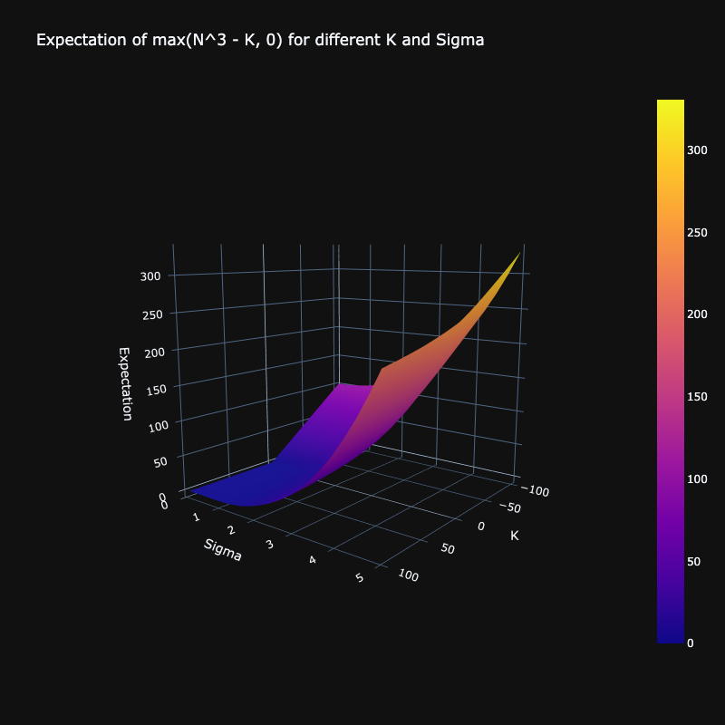

# Monte Carlo Simulation and Variance Estimation

This project demonstrates the use of Monte Carlo simulation to estimate the expected value of the expression `(N^3 - K)^+`, where `N` is a normally distributed random variable. The notebook also includes variance estimation and visualization.

## Project Structure

### Monte Carlo Estimation
The goal is to determine the expected value of \((N^3 - K)^+\), where:
- \(N\) is a normal random variable with a mean of one and standard deviation of three.
- \(K\) is a given positive constant.

The expression for the expectation is:
\[
\theta = E[(N^3 - K)^+]
\]

### Implementation
The project includes a function `MC_theta` to perform the static Monte Carlo approximation for the expectation of \(\max(N^3 - K, 0)\).

#### Function: `MC_theta`
**Inputs:**
- `mu`: Mean of the normal random variable \(N\).
- `sigma`: Standard deviation of \(N\).
- `K`: Parameter in the function.
- `n`: Monte Carlo sample size.
- `seed`: Random seed parameter for reproducibility.

**Outputs:**
- Estimation of the expectation of \(\max(N^3 - K, 0)\).

### Visualization
The project includes visualizations to illustrate the distribution of the simulated values and the resulting estimations.
