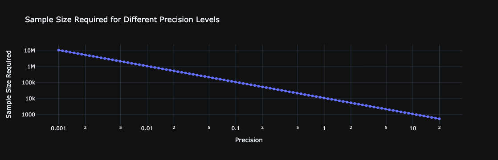

# Derivative Pricing and Computational Finance Methods

This repository contains various projects and implementations related to derivative pricing and computational methods. Each folder contains code and documentation for different techniques and models used in the field of quantitative finance.

**Note:** This repository is currently a work in progress, and I am still in the process of uploading and organizing the projects. Please check back regularly for updates.

## Folder Structure

- [**Monte_Carlo_Simulation_and_Variance_Estimation**](Monte_Carlo_Simulation_and_Variance_Estimation): 
  - This project demonstrates the use of Monte Carlo simulation to estimate the expected value of any given expression. 
  - The project also includes variance estimation and visualization.
  
  

    
    
  

- [**American_Options_Binomial_Tree**](./American_Options_Binomial_Tree): 
  - Implementations of the binomial tree model for pricing American options.
  - Includes examples and explanations of the binomial tree approach.
  

- [**Monte_Carlo_Variance_Reduction_Importance_Sampling**]: 
  - "Stay tuned for upcoming updates!"

- [**Dynamica_Monte_Carlo_and_Stochastics_Volatility_Model**]: 
  - "Stay tuned for upcoming updates!"

## Getting Started

To get started with any of the projects, navigate to the respective folder and follow the instructions provided in the README.md file within each folder.

## About Me

I am a Master's student in Quantitative Finance with dual bachelor's degrees in Science and Business Administration. My academic focus includes artificial intelligence, statistics, and finance. Most of the projects in this repository provide solutions for financial applications by utilizing advanced computational methods. Visit my [personal website](https://justinyuchi.github.io/justinyuchihsu.github.io/) for more about my work and interests.

## License

This repository is licensed under the MIT License. See the [LICENSE](LICENSE) file for more details.

